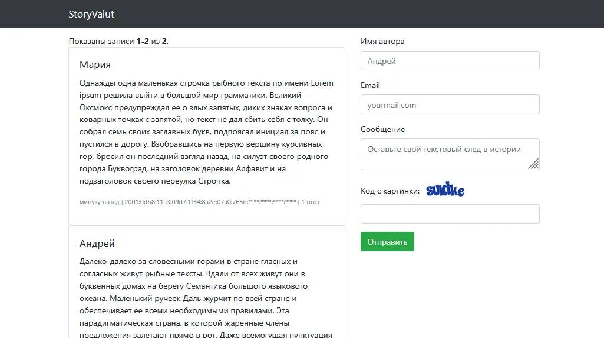

# Разработка StoryValut (Yii2)

## 📖 Описание

Создать приложение **“StoryValut”**, в котором любой пользователь может оставить своё сообщение.



---

## ⚙️ Требования к приложению

1. **Фреймворк:** Yii2 (рекомендуется шаблон `basic`)
2. Все лишние стандартные страницы Yii2 Basic вроде `About`, `Contact` должны быть удалены
3. Проект должен быть оформлен, как **реальный коммерческий продукт**:
    - понятный и логично структурированный код;
    - внимание к безопасности;
    - поддерживаемость и простота дальнейшего развития;
    - наличие документации.
4. Разрешается использовать сторонние библиотеки и встроенные возможности фреймворка Yii2.

---

## 📨 Требования к отправке постов

- [ ] **Ограничения символов:**
    - Имя автора: минимум 2 символа, максимум 15.
    - Сообщение: минимум 5 символов, максимум 1000.
- [ ] Валидный e-mail
- [ ] Каптча / Рекаптча
- [ ] IP автора должен записываться
- [ ] Дата публикации сохраняется в **UnixTime**
- [ ] Сообщения, состоящие только из пробелов, запрещены
- [ ] Автор может отправить **только 1 сообщение в 3 минуты**  
  При попытке раньше — выводить ошибку с указанием времени, когда можно будет опубликовать следующее сообщение.

---

## 💬 Требования к выводу постов

- [ ] Посты должны выводиться в формате **Bootstrap Card**

> 💡 Пример готовой разметки:

```html
<div class="card card-default">
  <div class="card-body">
    <h5 class="card-title">{{author}}</h5>
    <p>{{message}}</p>
    <p>
      <small class="text-muted">
        {{createdAtRelative}} |
        {{ip}} |
        {{postsCount, plural,
            =0 {нет постов}
            one {# пост}
            few {# поста}
            many {# постов}
            other {# поста}
        }}
      </small>
    </p>
  </div>
</div>
```

- [ ] Отображать **общее количество сообщений автора** (на основе IP)
- [ ] Разрешать использование только HTML-тегов: `<b>`, `<i>`, `<s>`
- [ ] Дата публикации отображается в формате **“Relative time”**  
  *(Пример: “10 минут назад”)*
- [ ] Полузакрытый IP адрес:
    - IPv4 → скрывать 2 последних октета (пример: `46.211.**.**`)
    - IPv6 → скрывать 4 последних секции (пример: `2001:0db8:11a3:09d7:1f34:8a2e:07a0:765d:****:****:****:****`)

---

## 🧰 Управление постами

- [ ] После отправки поста — отправлять автору e-mail с приватными ссылками для управления:
    1. Редактирование поста
    2. Удаление поста

> ℹ️ Реальную отправку настраивать **не нужно**.  
> Проверка выполняется в отладочном режиме отправки почты Yii2.

- [ ] **Редактирование** доступно в течение **12 часов** после отправки  
  Разрешено редактировать только текст сообщения. Применяются те же правила валидации.
- [ ] **Удаление** доступно в течение **14 дней** с момента публикации.  
  Реализуется как *soft delete* — запись остаётся в базе, но скрывается.  
  Подтверждение удаления выполняется на отдельной странице с подтверждением действия.

---

## 🧩 Структура проекта (пример)

```
app/
├── components/
│   ├── SoftDeleteBehavior.php
│   └── TextHelper.php
├── controllers/
│   └── PostController.php
├── events/
│   ├── PostCreatedEvent.php
│   └── dispatcher/
│       └── EventDispatcher.php
├── filters/
│   ├── CreatePostLimitFilter.php
│   ├── EditPostLimitFilter.php
│   └── DeletePostLimitFilter.php
├── listeners/
│   └── SendPostCreatedEmailListener.php
├── models/
│   ├── Form/
│   │   ├── PostBaseForm.php
│   │   ├── PostCreateForm.php
│   │   └── PostEditForm.php
│   ├── Query/
│   │   └── PostQuery.php
│   └── Post.php
├── repository/
│   └── PostRepository.php
├── services/
│   ├── PostService.php
│   └── EmailService.php
└── views/
    └── post/
        ├── index.php
        ├── _form.php
        ├── _post.php
        └── edit.php
```

---

## 🧠 Используемые подходы

- DDD-структура (Entities / Repositories / Services / Listeners)
- Event-Driven Architecture (через `EventDispatcher`)
- Soft Delete через поведение (`SoftDeleteBehavior`)
- Email-уведомления (debug mode)
- Валидация и фильтрация на уровне форм (`Form Models`)
- Bootstrap 5 + Yii ActiveForm для UI

---